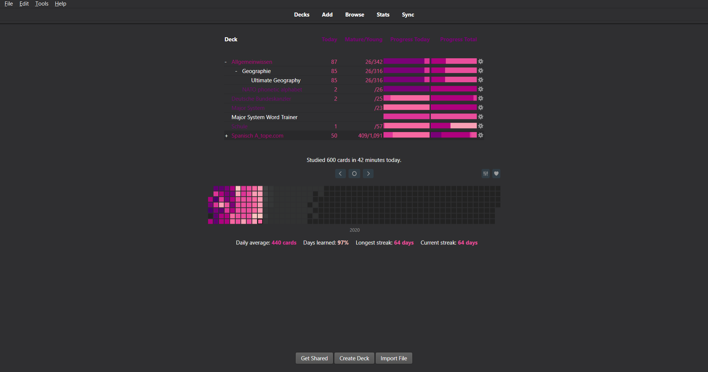
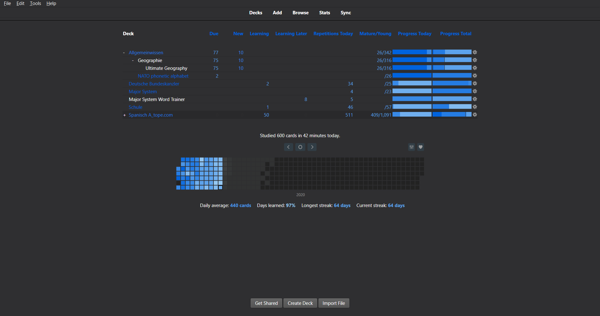

# enhancemainwindowthemes
Themes for the anki addon enhance main window




For more screenshots see the enhancemainwindow directory.

## Templates
In this repo you will find 2 templates, these contain the corresponding config file, instead of actual colors there are placeholder which will be overwritten by the python script.

## colorschemes.json
This json file contains all of the color defenitions for all of the color schemes.

## Python Script
You can execute the python script with the name of a colorscheme as the first argument to update the file. Do this if you have changed settings in the template or colors in the colorschemes.json
```
# If you're on an arch based system; If you only have python3.x installed
python parser.py "pinky"
# If python still defaults to python2 on your os
python3 parser.py "pinky"
```

## Makefile
Running `make` will run the parser on all colorschemes.
